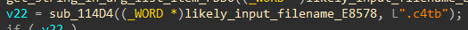
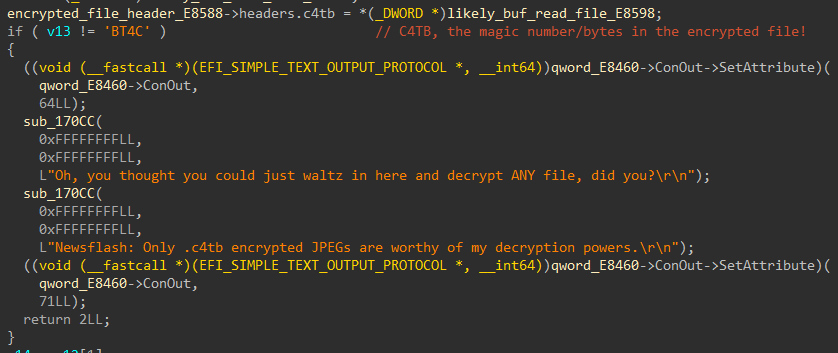
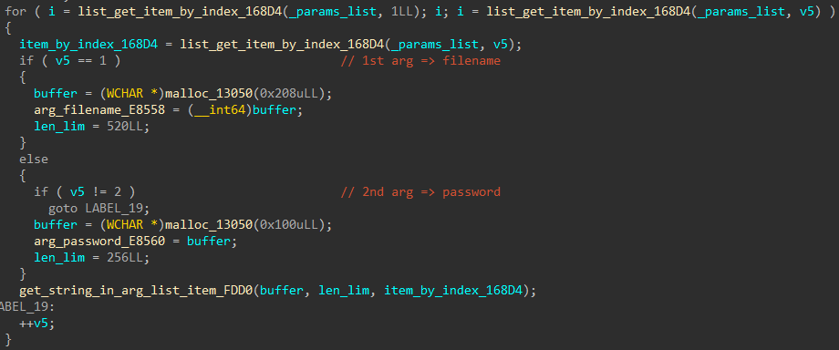
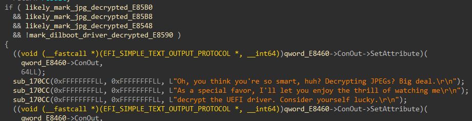
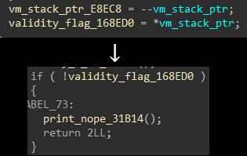
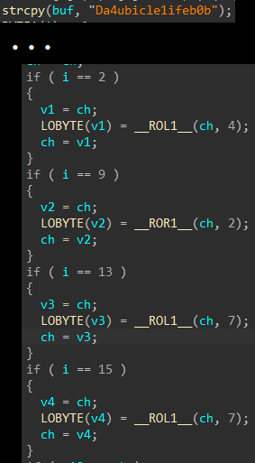
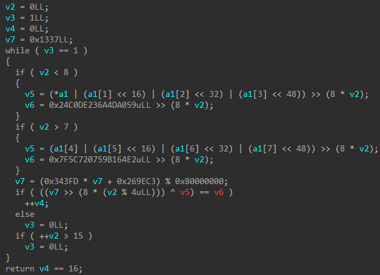
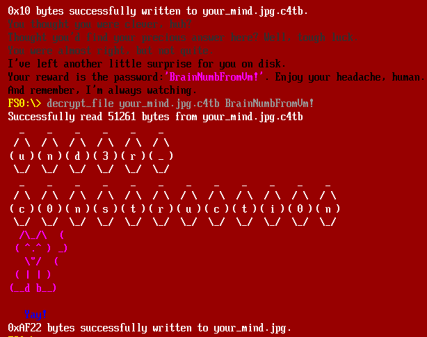

# Challenge 10 - Catbert Ransomware

This challenge comes with two files. A BIOS ROM and a disk image. The ROM contains a bunch of EFI executables, and the disk image has several encrypted files with the extension ".c4tb" in it.  

Similar to Ch5, the first thing is to identify the executable responsible. Fortunately, this time the program can be run with QEMU. Even better, I just used 7-zip and found that the UEFI shell is the culprit (as only it contains the magical string "c4tb").  

## Basic Reversing

Knowing that it's a UEFI program, I just threw it into IDA. At first glance, the author of this challenge seems quite forgiving this time. Most, if not all strings are in plain text. I searched for "c4tb" in the strings tab, and some interesting messages popped out. Maybe this is the core function?  

<figure>
  
  <figcaption>Fig. 1: Function at 0x31BC4 referencing the text ".c4tb"</figcaption>
</figure><br/><br/>

The function also contains some other promising texts, such as the JPG magic bytes "JFIF". It even comes with a reference to that eye-catching file "DilbootApp.efi.enc". The author is indeed quite forgiving, and I figured out what many crucial functions are by making assumptions based on the console output texts.  

<figure>
  
  <figcaption>Fig. 2: A sample part of the function that checks the magic bytes of an encrypted file input.</figcaption>
</figure><br/><br/>

Also, the corresponding command is "decrypt_file", and by looking for references to the filename buffer, it's obvious that calls to function at 0x168D4 are to retrieve command line arguments by an index.  

<figure>
  
</figure><br/><br/>

Scrolling down the function shows an if block with some console output suggesting that it will decrypt "DilbootApp.efi" when certain conditions are met. Looking around for the condition variables suggests that once all three jpeg files are decrypted, the program will also decrypt the EFI file as a treat.  

<figure>
  
</figure><br/><br/>

The mentioned conditions are set when the derived RC4 key has a certain CRC32-like sum. From this decrypt_file function and the RC4 implementation, it seemed like a valid password/key must be 16-byte long, and it is impossible to recover the passwords from these checksums. Furthermore, the actual checks that determine whether it should proceed to decrypt a file aren't related to those marks anyway; instead, they reside in the function at 0x31274.  

## Embedded VM

From IDA outputs, I found that the decrypt_file function parses the first 16 bytes of a c4tb file, extracts some data at the end of the input file, and passes the data buffer to the checking function. It turns out the extracted data buffer is supposed to be some bytecodes, and the function at 0x31274 is actually a stack machine VM. When a certain bytecode is met, the VM pops a value on the stack and stores it in the marking variable. This is what `decrypt_file` function checks before decrypting the file.  

<figure>
  
</figure><br/><br/>

At this point, all I have to do is to get an idea of what all the opcodes are and recover the bytecodes' logic in each of the c4tb files. I put my notes detailing the opcodes in [`notes/opcodes.txt`](./notes/opcodes.txt) and my simple disassembler in [`src/vm-disasm.js`](./src/vm-disasm.js).  

Once I disassembled the bytecodes, I intuitively wanted to decompile them to make understanding them much less of a chore. In this case, the author is again really forgiving. All opcodes are simple, and the bytecodes are not obfuscated at all. Even better, the max stack depth never exceeds 6, which means I could make a transpiler that turns these bytecodes into a pseudo x64 register machine code, and hope that existing decompilers can produce somewhat conceivable outputs.  

I implemented this in a really crude way, that is, I tracked the stack size at each opcode in a bytecode function, then used registers r8-r15 as an array stack to store variables. I also made an assumption that the global array storage (following the opcodes buffer in memory) used by some opcodes wouldn't write too much data, and I just allocated a 0x1000-byte stack buffer as the substitution.  

In the decrypt_file function, it also populates certain bytes at some fixed positions in the bytecodes before running them. Those are derived from the input passwords and I simply replaced them with a pointer `mov` from register `rdi`, which is the first argument in the x64 Linux calling convention.  

I put my transpiler in [`src/vm-transform.js`](./src/vm-transform.js).  

To my surprise, throwing those reassembled "shellcode" binaries in IDA produced really lovely results. All three bytecode functions produced clean decompilation outputs.  

## Bytecodes

### `catmeme1.jpg.c4tb`:  
This one is simple. The password is just a stack string with the 2nd, 9th, 13th, and 15th bytes rotated.  
<figure>
  
</figure><br/><br/>
  
**Password**: `DaCubicleLife101`  
  
  
### `catmeme2.jpg.c4tb`:  
This one is also fairly simple. It's just a hard-coded XOR "encryption" loop.  
<figure>
  
</figure><br/><br/>
  
**Password**: `G3tDaJ0bD0neM4te`  

### `catmeme3.jpg.c4tb`:  
The last one is the most complicated. It checks the following:
 1. If the DJB2 hash of `password[0:4]` equals 0x7C8DF4CB.  
 2. If the ROR13 hash of `password[4:8]` is 0x8B681D82.  
 3. If the adler32 sum of `passwd[8:16]` is 0x0F910374.  
 4. If the FNV1a hash of `password` equals 0x31F009D2.  
  
The first 2 can be easily cracked. Just iterate through all valid 32-bit integers as 4 ASCII characters and see what matches. This can be done within seconds on modern CPUs using C.  
Password\[0:8\]: `VerYDumB` (DJB2(password\[0:4\]) has more than one solution, but only "VerY" seemed to make any sense.)  

Now, let's deal with the hard part. The last one is definitely out of scope. FNV1a operations involve folding, and all 8 last letters must be brute-forced at once. There is no way for me to do it. I had to focus on the 3rd check.  

Since adler32 is a simple algorithm, and I knew that it takes way more than 8 characters to have the modulo of 0xFFF1 taking any effect (`(8 * 9) / 2 * 0xFF + 8 = 0x23E4 < 0xFFF1`). The sum and weighted sum of 8 latter characters are `0x374 - 1 = 0x373` and `0xF91 - 8 = 0xF89`, respectively. Furthermore, I made an assumption that this password is also alphanumeric. First, I decided to try my luck and used Z3 to list all possible combinations. As you may have guessed, it was extremely slow. A custom algorithm must be the only way to deal with this AFAIK.  

By redefining certain operations, I can make adler32 without modulus a recursive operation. The problem I was dealing with turned into a nice dynamic programming problem.  
 1. Define `S1(str) = strlen(str) * str[0] + S1(&str[1])`  
 2. Define `S2(str) = str[0] + S2(&str[1])`  

Then I came up with a really primitive draft with no optimization at all:  
```C
void recursive_crack(char *str, uint8_t depth, int32_t adler32high, int32_t adler32low)
{
  uint8_t i;
  
  if(depth == 8)
  {
    if(adler32high == 8 && adler32high == 1)
    {
      printf("%*.s\n", 8, str);
    }
  }

  for(i = 0 ; i < CHARSET_SIZE ; i++)
  {
    str[depth] = CHARSET[i];
    recursive_crack(str, depth + 1, adler32high - (8 - depth) * str[depth], adler32low - str[depth]);
  }
}
```

I didn't have to evaluate its time complexity to figure out that this cannot be done within a reasonable time span. So, let's add some constraints.  
 1. Only alphanumeric characters are allowed, that is, each byte in the string must be between 0x30 and 0x7A (both inclusive).  
 2. At `depth == 6`, there exists only one valid solution at most (two unknowns with two linear equations).  

```C
void recursive_crack(char *str, uint8_t depth, int32_t adler32high, int32_t adler32low)
{
  uint8_t i, left;
  uint16_t c;

  left = DEPTH - depth;

  // Test if there must be a character below 0x30. If so, this iteration is in an invalid state and there is no need to proceed.
  if(adler32high < (((left * (left + 1)) >> 1) * 0x30 + DEPTH) || adler32low < (0x30 * left + 0x1))
  {
    return;
  }

  // Test if there must be a character above 0x7A. If so, this iteration is in an invalid state and there is no need to proceed.
  if(adler32high > (((left * (left + 1)) >> 1) * 0x7A + DEPTH) || adler32low > (0x7A * left + 0x1))
  {
    return;
  }

  // There are only 2 unknown bytes left. Just solve the linear equations.
  if(left == 2)
  {
    str[depth] = (adler32high - 8) - (adler32low - 1);
    if(!test_alphanumeric(str[depth]))
    {
      return;
    }

    str[depth + 1] = (adler32low - 1) - str[depth];
    if(!test_alphanumeric(str[depth + 1]))
    {
      return;
    }

    printf("%s\n", str);
  }

  for(i = 0 ; i < CHARSET_SIZE ; i++)
  {
    c = CHARSET[i];
    str[depth] = c;
    recursive_crack(fnv1a_seed, str, depth + 1, adler32high - (DEPTH - depth) * c, adler32low - c);
  }
}
```

Voila! The program produced all the valid 8-char combinations within seconds. I later modified my program to also check the FNV1a hash. I put the C code in [`src/adler32-crack.c`](./src/adler32-crack.c).  

**Password**: `VerYDumBpassword`  
  
## DilbootApp

Running the given ROM in QEMU and supplying my findings indeed made the shell decrypt `DilbootApp.efi`. Turns out this is just a simple program that writes your_mind.jpg.c4tb onto the disk. It also gave me the password! I didn't believe it though, so I transpiled the new bytecodes and decompiled it. The password matched.  

<figure>
  
</figure><br/><br/>

## Where's the Flag?

Here comes the really funny part. I thought the flag would sit somewhere in the last stage, but nothing I got was the correct flag. I *was* pretty sure I've got everything I have to reverse and started to panic. Out of desperation, I finally decided to open those "catmemes" images.  

Guess what? The first half of the flag is in those 3 images. The false flag from the last year got me real good. LMAO!  

### Flag: `th3_ro4d_t0_succ3ss_1s_alw4ys_und3r_c0nstructi0n@flare-on.com`  

&nbsp;&nbsp;&nbsp;Yay!
