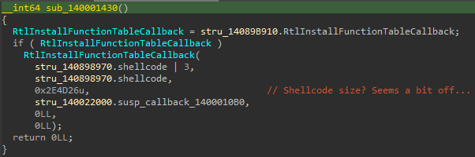

# Challenge 9 - Serpentine

By the time I got here, I already knew that this was the most difficult challenge this year. The scoreboard told me everything.  

The challenge file comes as a high entropy PE. It's also a chunky boy, too. This stuff has almost all the characteristics to send a chill down my spine. It was gonna be a tough one.  

## Basic Reversing

This program has a really simple main function. Input a 32-char flag, and it tells you whether you've got it correct or not. The shellcode buffer is set up with the classic TlsCallback trick.  

<figure>
  
  <figcaption>Fig. 1: Main function in IDA</figcaption>
</figure>

The well-paved road ends right here.  

At first glance, it looks like the shellcode is encrypted. I tried to debug it with x64dbg, and instantly found that isn't the case. The first instruction is `hlt`, a privileged instruction that should not occur in any user-mode program.  

<figure>
  
</figure>

This certainly reminded me of a popular malware cryptor named "GuLoader" which uses VEH to obfuscate its control flow. But, doing so requires the program to set up a custom exception handler beforehand. Where is it in this challenge?  

In MSVC, C/C++ programs are linked against a C runtime (CRT) stub that populates pre-main global variables and prepares arguments for the main function. The prior is implemented in CRT by calling a list of functions defined in itself. In IDA, the list looks like this, with two eye-catching labels, "First" and "Last", marking the first and the last function pointers in the list.  

<figure>
  
</figure>

It turned out that the API used here is `RtlInstallFunctionTableCallback`, set up by the last function at `0x140001030` in the pre-main list.  

<figure>
  
  <figcaption>Fig. 4: Retrieving the address of RtlInstallFunctionTableCallback in NTDLL</figcaption>
</figure>

<figure class="image">
  
  <figcaption>Fig. 5: Setting up exception callback with RtlInstallFunctionTableCallback</figcaption>
</figure>

## Exception-Based Control Flow Bbfuscation

On MSDN, it says that `RtlInstallFunctionTableCallback` installs a callback function that provides unwind information for dynamic codes. Essentially, a program may use this to define a region of code that, when an exception is thrown within the region, the kernel will instruct the user-mode handler to make a call to the installed callback function and will use the `RUNTIME_FUNCTION` structure returned by the callback function to determine how it should unwind (a.k.a. revert) the execution and handle the exception.  

<figure class="image">
  
  <figcaption>Fig. 6: Callback function at 0x1400010B0</figcaption>
</figure>

But how exactly does Windows unwind the execution and return the execution back to the code in this defined region? It turns out [MSDN also has a dedicated page to document this](https://learn.microsoft.com/en-us/cpp/build/exception-handling-x64).

From the implementation of the callback function, I learned that only the 3rd item, `UnwindInfo`, is important. Let's look into what the structure UNWIND_INFO defines.  

<figure class="image">
  
</figure>

Oof. That wasn't as simple as what I was expecting. Therefore, I decided to just debug the program and take a look at the data first.  

In x64dbg, I followed through the first few exceptions thrown within the shellcode and figured out the following patterns:  
 1. All exceptions I got are `hlt`s.  
 2. All unwind descriptors I met end with the type (1), which specifies an exception handler function RVA.  
 3. Exception handlers also reside in the shellcode, and never return. This means the "original code" never "resumes". I looked into the stack, and it also just kept growing. (In hindsight, that's why the first pre-main call at 0x140001060 was to remove the stack size limit in PEB!)  
 4. Unfortunately, counts of unwind codes aren't always 0.  

As it would be virtually impossible to get anything actually useful to solve the challenge by just debugging this massive chunk of obfuscated code, I knew I must produce a custom parser/deobfuscator. At the moment, I decided to skip parsing the unwind code slots and simply treat them as JMPs (bad idea!).  

Since the code jumps back and forth within the shellcode and extra information is also embedded in it, a linear disassembler would definitely not work at all. My parser must follow the control flow in order to extract anything meaningful. So I made some assumptions to make it easier.  
 1. *Assumption*: all exceptions are triggered by `hlt`s, and all unwind info entries end with the type (1), an exception handler.  
    *Implementation*: whenever a `hlt` instruction shows up, locate the unwind information and the exception handler RVA.  
 2. *Assumption*: exception handlers never return and can be treated as `jmp`s.  
    *Implementation*: treat all exceptions as a direct `jmp`.  

## Self-Modification and Assembly Obfuscation

With an understanding of how exceptions are processed in the shellcode, I can now step through the code inside a debugger. Some parts of the code were especially eye-catching, as they modify some instructions right after it, and after the modified instructions have been run, some other instruction destroys the once valid code.  

<figure class="image">
  
  <figcaption>Fig. 8: An example of the self-modification pattern (in its decoded/valid state).</figcaption>
</figure>

Another pattern of self-modifying codes is the call-return stub. A `pop` writing to an IMM32 relative address follows right after a `call`. Later in the code, that address gets a small increment and is eventually moved back into `[rsp]`.  

<figure class="image">
  
  <figcaption>Fig. 9: An example of the call-return stubs (in its valid state).</figcaption>
</figure>

To make my life easier, I made a bunch of assumptions after walking through several instances of those patterns, and I implemented some simple detections to deal with them.  
 1. *Assumption*: self-modifying instructions (type 1) always have the structure:
    ```assembly
    push  rax
    mov   rax, 0
    mov   ah, byte [IMM32]           # Relative address
    lea   eax, dword [eax + IMM32]
    mov   dword [rip + 1], eax       # Always the instruction right after pop
    pop   rax
    ```
    *Implementation*: my parser writes "good" instructions to the memory and discards "bad" writes.  

 2. *Assumption*: self-modifying return stubs (type 2) always have the structure:
    ```assembly
    call  IMM32
    ...
    pop   qword [IMM32]              # Relative address
    ...
    push  rax
    mov   rax, IMM64                 # Overwritten return address as IMM64
    lea   rax, qword [rax + IMM8]    # A small, positive jump distance
    xchg  qword [rsp], rax           # Move the new destination back to the stack
    ret                              # Jump!
    ```
    *Implementation*: my parser detects **i.\)** chained `call`-`pop [IMM32]` sequences and writes the return address to the specified memory position, and **ii.\)** return stubs and turns them into direct `jmp`s.  

 3. *Assumption*: instructions are never used as data. That is, I don't have to worry about self-modified parts being used as data.  
 4. *Assumption*: all jumps are stateless and thus deterministic, including those `call` and `ret` instructions. This also implies that the shellcode execution must be linear (e.g. no JMP to an address in a register).  
    *Implementation*: discard all JMP-equivalent instructions that fit the assumption.  

It is crucial to always keep in mind that the actual problem may not follow one's assumptions. So I tried to make sure I dealt with unexpected inputs properly and made my script stop parsing the obfuscated blob when anything unexpected occured. Nevertheless, I have to mention that, I somehow totally forgot about branching jumps (e.g. `JZ`) and didn't detect them at all. I was super lucky that this assumption was accurate enough and it didn't bite me in the back.  

These assumptions worked well until some unexpected instructions popped up.  
```assembly
cmovne r12, r15
jmp r12
```
Since the jump destination is modified by a conditional `mov`, it is no longer stateless. Debugging the code made me realize that it's simply jumping to the "wrong key" function (0x1400011F0) when `r14` isn't zero. I was pretty sure that the stub must be a special check.  

<figure class="image">
  
</figure>

## Unwind Codes Revisited

My parsed result at this point looked promising. There was no invalid instruction, and it turned out that most of my assumptions were correct. Nevertheless, when I took a closer look at the outputs, I found that the shellcode often dereferences pointers in `[R9 + 0x28]` after triggering an exception. Remember that all exception handlers never return? This means the code never reaches the `NtContinue` syscall (unlike GuLoader), and all registers should be volatile. Or should they?  

One way to restore registers' information is to store them in the stack before triggering an exception and then calculate where in the stack we can find them given the modified `RSP` in our exception handler. However, this will likely be highly version-dependent and difficult to implement. There must be a more simple way to accomplish this. Let's see how `NTDLL` implements the exception handling stuff.  

By tracing call stacks in a debugger, I found that exception handlers are actually called by `RtlpExecuteHandlerForException`, and the register R9 contains a `DISPATCHER_CONTEXT` structure. At offset 0x28 lies a `PCONTEXT` pointer, which is exactly what I was looking for - the storage of registers' information before when an exception occurs!  

Besides, the shellcode uses a special 32-bit register named `MxCsr`, and I had to find a substitution (`MxCsr` cannot be read directly). I used `XMM0` as its alternative.  

After replacing those pointer references with simple `mov`s, I noticed yet another problem. Some registers retrieved from the `CONTEXT` structure are never written to in the previous code block. It turned out that unwind code actually manipulates the `CONTEXT` data, and I had to parse it. The MSDN documentation of this section isn't very clear in my opinion. It denotes what operation the unwind opcode reverts instead of what the opcode actually does. 

Let's take a look at an example in the shellcode.  
<figure class="image">
  
</figure>

Following the documentation of `UNWIND_CODE` on [MSDN](https://learn.microsoft.com/en-us/cpp/build/exception-handling-x64#struct-unwind_code), I converted the opcodes into equivalent x64 pseudo operations. E.g.
```
00 0A       => ctx->rip     = *(ctx->rsp)
               ctx->cs      = *(ctx->rsp + 8)
               ctx->eflags  = *(ctx->rsp + 16)
               ctx->ss      = *(ctx->rsp + 32)
               ctx->rsp     = *(ctx->rsp + 24)

00 11       => ctx->rsp    += 4
04 00 00 00

00 D0       => ctx->r13     = *(ctx->rsp)
               ctx->rsp    += 8
```

Since I didn't see any instructions that access special registers other than `MxCsr`, I can simplify the example above into the following sequence:  
```assembly
mov   rsp, qword [rsp + 0x18]
add   rsp, 4
pop   r13
```

Nevertheless, this sequence would leave a really bad taste in the memory. Debugging the instructions showed that the modified `RSP` points to somewhere in the `.data` section and destroys the control flow. Luckily, a better equivalent exists.  
```assembly
mov   r13, qword [rsp + 0x18]
mov   r13, qword [r13 + 4]
```

I made a simple modification in my script to report all UWOP sequences occurring in the obfuscated assembly. Only the following showed up.  
```
0x3 -> 0x0
0x3 -> 0x1 -> 0x0
0x3 -> 0x2 -> 0x0
0xA -> 0x0
0xA -> 0x1 -> 0x0
0xA -> 0x2 -> 0x0
```
This is great, as I can systematically simplify all the UWOP sequences into their equivalent x64 assembly codes.  

## More Deobfuscation

At this point, I felt like the deobfuscation was mostly complete and threw the results in IDA. As expected, the decompilation output was way off. At first, I thought it might be because the assembly was still too complicated, but a closer inspection told me that I made a wrong assumption. I thought I could just replace all references to a `PCONTEXT` member with a simple `mov`. That was not the case. The corresponding registers sometimes get written to before the ones in the `PCONTEXT` are used. Thus, the deobfuscation result was incorrect.  

I was a bit lazy and decided to go for an easier route. Just allocate a global storage and cache all the registers in it when a `hlt` shows up. The resulting assembly runs correctly but IDA refuses to clean up the decompilation output. My 2nd attempt detects those write-before-read accesses in each block and finds unused registers to cache them. This worked well enough to let me analyze the deobfuscated assembly.  

Furthermore, I made my script properly detect those special `jmp reg` instructions and recover the address to the next obfuscated blob. In total, 32 assembly blobs were found and deobfuscated.  

I put the deobfuscation scripts under [`src/phase1/deobf.py`](./src/phase1/deobf.py) and [`src/phase2/deobf.py`](./src/phase2/deobf.py). Phase-one script removes the exceptions, mutations and junk code. Phase-two script transforms the global storage into free registers.  

Deobfuscation results finally looked somewhat wellformed in IDA, and I decided it was time to actually analyze its underlying logic.  
<figure class="image">
  
  <figcaption>Fig. 12: Part of the deobfuscation results (blob 1) in IDA</figcaption>
</figure>

## Math

I actually still got quite confused when I saw the results. It looked like a bunch of s-box swapping and folding operations. If that were the case, by no means I would be able to solve this. Interestingly, a pattern seemed to emerge when I checked those hardcoded arrays. The assembly implements addition, subtraction, and XOR in funny ways. Those linear s-boxes are just the byte-wise addition/subtraction results, and those with 0s and 1s are just the carry bits. XORs are also just some simple s-boxes. After some manual data reconstruction, the first assembly blob became:  

```C
// Pseudo code
noreturn void blob01(const unsigned char *flag)
{
  uint32_t x = 0;
  x += 0xEF7A8C * flag[4];
  x += 0x9D865D8D;
  x -= 0x45B53C * flag[24];
  x += 0x18BAEE57;
  x -= 0xE4CF8B * flag[0];
  x -= 0x913FBBDE;
  x -= 0xF5C990 * flag[8];
  x += 0x6BFAA656;
  x ^= 0x733178 * flag[20];
  x ^= 0x61E3DB3B;
  x ^= 0x9A17B8 * flag[16];
  x -= 0xCA2804B1;
  x ^= 0x773850 * flag[12];
  x ^= 0x5A6F68BE;
  x ^= 0xE21D3D * flag[28];
  x ^= 0x5C911D23;
  x -= 0x81647A79;

  CODE *jmp_target = ptr_2nd_blob;
  if(x !== 0)
  {
    jmp_target = func_invalid_flag;
  }
  JMPOUT(jmp_target);
}
```

Now, the problem was how I could efficiently extract all the array information. Manually extracting `(32 * 4 * 9 = 1152)` entries would be both too tedious and error-prone. Therefore, I produced a dirty script to extract the info for me. You may find the script in [`src/phase3/parser.js`](./src/phase3/parser.js). The script is going to be used only once, so the code quality is abysmal. Though I argue that it's still better than `hlt`-laced shellcode though.  

With all the info (I had to fix a couple of faulty parsing outputs) extracted, I put them into Z3, and voila, the answers were available within a minute. I put all the constants and the meta-script for generating Z3 scripts under [`src/phase3/constants/`](./src/phase3/constants) and [`src/phase3/z3gen.js`](./src/phase3/z3gen.js).  

### Flag: `$$_4lway5_k3ep_mov1ng_and_m0ving@flare-on.com`  
